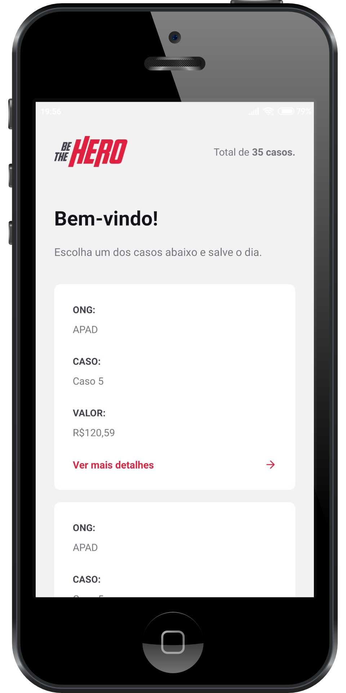
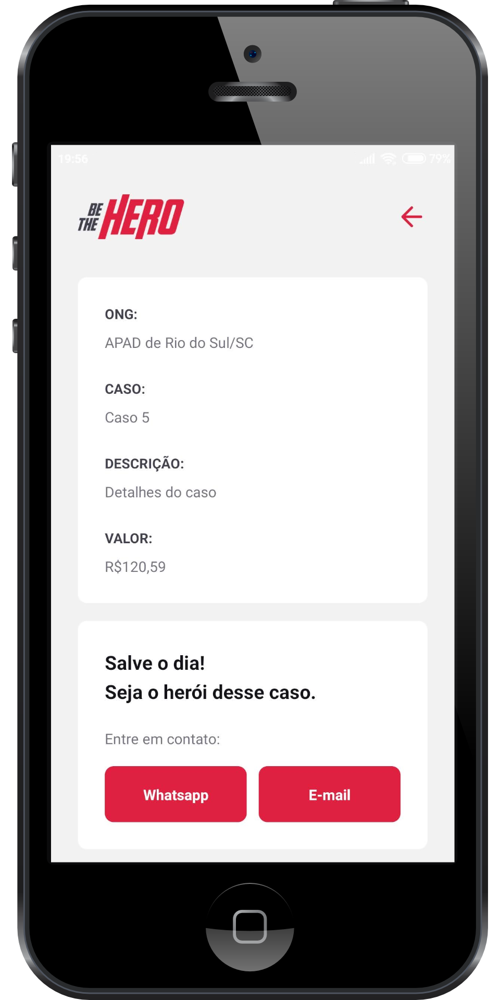

<!-- PROJECT LOGO -->
<p align="center">
  <a href="https://github.com/cristianprochnow/BeTheHero">
    
  </a>

  <p align="center">
    A maneira mais rápida de salvar o dia ajudando uma ONG.
    <br />
    <a href="https://github.com/cristianprochnow/BeTheHero"><strong>Explore the docs »</strong></a>
    <br />
    <br />
    <a href="https://github.com/cristianprochnow/BeTheHero">View Demo</a>
    ·
    <a href="https://github.com/cristianprochnow/BeTheHero/issues">Report Bug</a>
    ·
    <a href="https://github.com/cristianprochnow/BeTheHero/issues">Request Feature</a>
  </p>
</p>

<!-- PROJECT SHIELDS -->
<div align="center">

  [![Contributors][contributors-shield]][contributors-url]
  [![Forks][forks-shield]][forks-url]
  [![Stargazers][stars-shield]][stars-url]
  [![Issues][issues-shield]][issues-url]
  [![Repo Size][repo-size-shield]][repo-size-url]
  [![Code Size][code-size-shield]][code-size-url]
  [![MIT License][license-shield]][license-url]

</div>
<br />

<!-- TABLE OF CONTENTS -->
<h2>📚 Table of Contents</h2>

* [About the Project](#about-the-project)
  * [Built With](#built-with)
* [Features](#features)
* [Getting Started](#getting-started)
  * [Prerequisites](#prerequisites)
  * [Installation](#installation)
* [Getting Started no Mobile](#getting-started-mobile)
* [Usage](#usage)
* [Roadmap](#roadmap)
* [Contributing](#contributing)
* [License](#license)
* [Contact](#contact)
* [Acknowledgements](#acknowledgements)

<br />

<!-- ABOUT THE PROJECT -->
<h2 id="about-the-project">📖 About The Project</h2>

<div align="center">
  
  
  
</div>

<br />

<p align="center">Projeto que é resultado da <code>Semana OmniStack 11.0</code> <strong><a href="https://rocketseat.com.br/">@Rocketseat</a></strong> .</p>

<br />

Aplicação que tem como objetivo a ajuda à ONGs de animais. Por meio disto, as ONGs que necessitam de auxílio abrem um chamada, pedindo ajuda. Quem deseja ajuda, simplesmente, por meio do anúncio que possui os dados para comunicação, entra em contato com esta ONG para ser o herói daquele mascote necessitado e assim salva o dia. Simples assim.

<h3 id="built-with">🔧 Built With</h3>

* [Node](https://github.com/nodejs/node)
* [React](https://github.com/facebook/react)
* [React Native](https://github.com/facebook/react-native)
* [Expo](https://github.com/expo/expo)

<br />

<!-- FEATURES -->
<h2 id="features">📋 Features</h2>

- [x] Cadastrar uma ONG
- [x] Cadastrar,listar e deletar casos para auxílio
- [x] Contato imediato por e-mail e WhatsApp, no mobile

<br />

<!-- GETTING STARTED -->
<h2 id="getting-started">🚀 Getting Started</h2>

<h3 id="prerequisites">📝 Prerequisites</h3>

* [Node](https://github.com/nodejs/node)
* [Yarn](https://github.com/yarnpkg/yarn) `OPCIONAL`
* [Expo](https://github.com/expo/expo)

<h3 id="installation">⚙️ Installation</h3>

Na pasta `backend`, execute os comandos:

**NPM**
```bash
npm install

npx knex migrate:latest

npm start
```

**Yarn**
```bash
yarn

npx knex migrate:latest

yarn start
```

Nas pastas `frontend` e `mobile`, execute os comandos:


**NPM**
```bash
  npm install
  
  npm start
```

**Yarn**
```bash
  yarn
  
  yarn start
```

<br />

> Portas recomendadas

```bash
  # Back-end
  3333
  
  #Front-end
  3000
```

<br /> 

<h2 id="getting-started-mobile">📱🚀 Getting started no <code>mobile</code></h2>

1. Execute os comandos `npm install` ou `yarn`, dentro da pasta **mobile**.
2. Configure o [arquivo da api](./mobile/src/services/api.js);
3. Substitua a parte da `baseURL`, que está lá destacada, com o endereço IP do PC que você está usando para rodar o projeto;
4. Inicie a execução do projeto;
5. Instale o Expo no seu smartphone [IOS](https://apps.apple.com/br/app/expo-client/id982107779) ou  [Android](https://play.google.com/store/apps/details?id=host.exp.exponent&hl=en);
6. Quando instalado, aponte um leitor de código QR (de preferência o que está dentro do App do Expo) para o código que localiza-se no **canto inferior esquerdo da página do navegador**, que abrira após o `start` do projeto;
7. E pronto, aproveite o conteúdo 🎉.

<br />


<br />

<!-- CONTRIBUTING -->
<h2 id="contributing">🔗 Contributing</h2>

Contributions are what make the open source community such an amazing place to be learn, inspire, and create. Any contributions you make are **greatly appreciated**.

1. 🍴 Fork the Project
2. 👯 Clone this project (`git clone https://github.com/cristianprochnow/BeTheHero.git`)
3. 🔀 Create your Feature Branch (`git checkout -b my-feature`)
4. ✔️ Commit your Changes (`git commit -m 'feat: My new feature'`)
5. 📌 Push to the Branch (`git push origin my-feature`)
6. 🔁 Open a Pull Request

<br />

<!-- LICENSE -->
<h2 id="license">📜 License</h2>

Distributed under the MIT License. See `LICENSE` for more information.

<br />

<!-- CONTACT -->
<h2 id="contact">📞 Contact</h2>

Cristian Prochnow - [![Linkedin][linkedin-shield]][linkedin-url]

Project Link: [https://github.com/cristianprochnow/BeTheHero](https://github.com/your_username/repo_name)

<br />

<!-- MARKDOWN LINKS & IMAGES -->
<!-- https://www.markdownguide.org/basic-syntax/#reference-style-links -->
[contributors-shield]: https://img.shields.io/github/contributors/cristianprochnow/BeTheHero.svg?style=flat
[contributors-url]: https://github.com/cristianprochnow/BeTheHero/graphs/contributors
[forks-shield]: https://img.shields.io/github/forks/cristianprochnow/BeTheHero.svg?style=flat
[forks-url]: https://github.com/cristianprochnow/BeTheHero/network/members
[stars-shield]: https://img.shields.io/github/stars/cristianprochnow/BeTheHero.svg?style=flat
[stars-url]: https://github.com/cristianprochnow/BeTheHero/stargazers
[issues-shield]: https://img.shields.io/github/issues/cristianprochnow/BeTheHero.svg?style=flat
[issues-url]: https://github.com/cristianprochnow/BeTheHero/issues
[license-shield]: https://img.shields.io/github/license/cristianprochnow/BeTheHero.svg?style=flat
[license-url]: https://github.com/cristianprochnow/BeTheHero/blob/master/LICENSE.txt
[repo-size-shield]: https://img.shields.io/github/repo-size/cristianprochnow/BeTheHero.svg?style=flat
[repo-size-url]: https://github.com/cristianprochnow/BeTheHero
[code-size-shield]: https://img.shields.io/github/languages/code-size/cristianprochnow/BeTheHero
[code-size-url]: https://github.com/cristianprochnow/BeTheHero
[linkedin-shield]: https://img.shields.io/badge/-LinkedIn-black.svg?style=flat&logo=linkedin&colorB=0077b4
[linkedin-url]: https://www.linkedin.com/in/cristianprochnow
